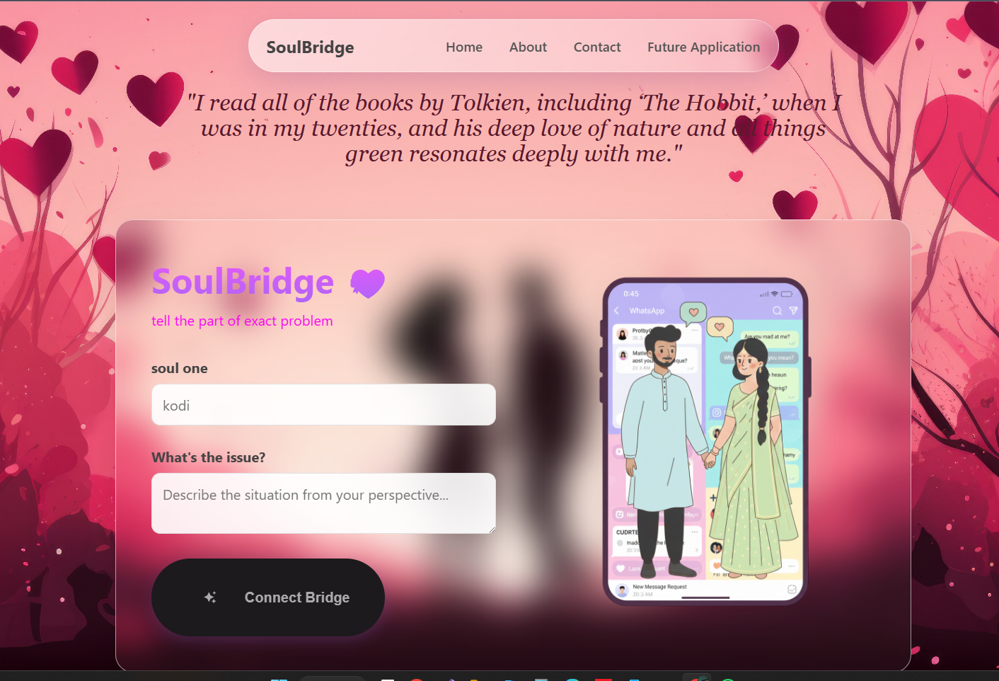

# 🌉 SoulBridge
I recently developed a project prototype inspired by a personal experience in a long-distance relationship  , where I faced challenges in clearly communicating emotions.

This concept focuses on:

 • Understanding both perspectives in a relationship

 • Using AI to help identify root causes of issues

 • Supporting better and more thoughtful decision-making

It is a session-based web application (no database) with a strong focus on privacy and real-time interaction.
SoulBridge is an emotional connection platform that helps people
build meaningful relationships and self-growth.

## 🚀 Features
- Emotional AI chat
- Relationship phase tracker
- Mental wellness support
- Private & secure conversations

## 🛠 Tech Stack
- HTML, CSS, JavaScript
- Node.js
- OpenAI API

## 🎯 Goal
To reduce loneliness and build strong emotional bonds.
